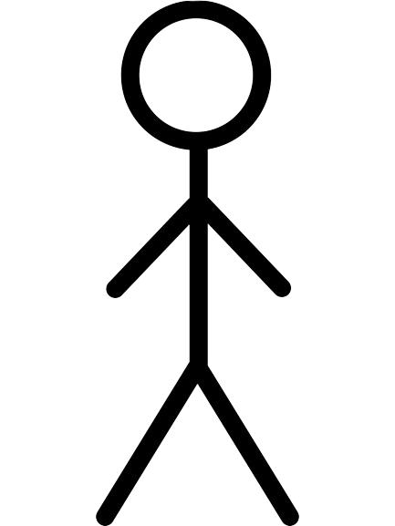
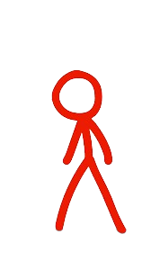

# Stickman Exploration - Functional Specifications

This project was dedicated to C++ OOP practicing.

Table of Contents

- [Stickman Exploration - Functional Specifications](#stickman-exploration---functional-specifications)
  - [Project Scope](#project-scope)
  - [Functional requirements](#functional-requirements)
  - [Use Cases](#use-cases)
    - [Game Mecanics](#game-mecanics)
    - [Controls](#controls)
  - [Appendix](#appendix)
    - [Main Character Sprites](#main-character-sprites)
    - [Backgrounds Sprites](#backgrounds-sprites)
    - [Grounds Sprites](#grounds-sprites)
    - [Platforms Sprites](#platforms-sprites)
    - [Enemies Sprites](#enemies-sprites)
    - [Game Screen Scheme](#game-screen-scheme)

## Project Scope

The main objectives of this game is to have a fully working game.
For this game I choose to use a stickman as main character and imagine him into desk environement with a paper background.

## Functional requirements

- The game must have a start and an end
- Enemy fights:
  - Stickman Fighters will fight with there hands inflicting damage to Stickman and can be killed by him.
  - Stickman Warriors will fight with a needle inflicting damage to Stickman and can be killed by him.
  - Stickman Rangers will fight by throwing paper balls inflicting damage to Stickman and can be killed by him
- Stickman:
  - He can move to left or right.
  - He can jump and crouch.
  - If the crouch key is pressed to times quickly and stickman is on a platform it will make him go down to the under platform or ground.
  - He has 20 heal points.
- Items:
  - Score:
    - Diamond from minecraft can be collected to get 10 points (common).
    - Seriglass shard from warframe can be collected to get 100 points (rare).
    - Red Robux from roblox, can be collected to remove 50 points (uncommon).
    - Kingdom credits from valorant can be collected to reset your score (rare).
  - Tools:
    - Pencil can be pickup to serve has range weapons.
    - Nuka cola caps can be pickup

## Use Cases

### Game Mecanics

| Use Case Name      | Winning                                                           |
| ------------------ | ----------------------------------------------------------------- |
| Actors             | Player, Game                                                      |
| Description        | The user must win when he reach the end of the level.             |
| Pre-conditions     | The user should cross the entire level without dying              |
| Normal Flow        | 1. Cros the level. 2. He the end point 3. The user has won. |
| Alternative Flows  | 1. If the user reach the ed point but is dead on it.              |
| Exception Handling | 1. It will be a lose.                                             |

### Controls

| name        | action       | key1 | key2        | description                                          |
| ----------- | ------------ | ---- | ----------- | ---------------------------------------------------- |
| Move right  | press/hold   | D    | Arrow Right | move the characters moving to right                  |
| Move left   | press/hold   | Q    | Arrow Left  | move the character to the right                      |
| Jump        | press        | Z    | Arrrow Up   | make the character jump                              |
| Crouch      | hold         | S    | Arrow Down  | make the character crouching                         |
| Down        | double press | S    | Arrow Down  | the character will go down if he isn't on the ground |
| Switch Item | press        | F    | NONE        | the character will switch between tool 1 and 2       |

## Appendix

### Main Character Sprites

### Backgrounds Sprites

### Grounds Sprites

### Platforms Sprites

### Enemies Sprites

### Game Screen Scheme

