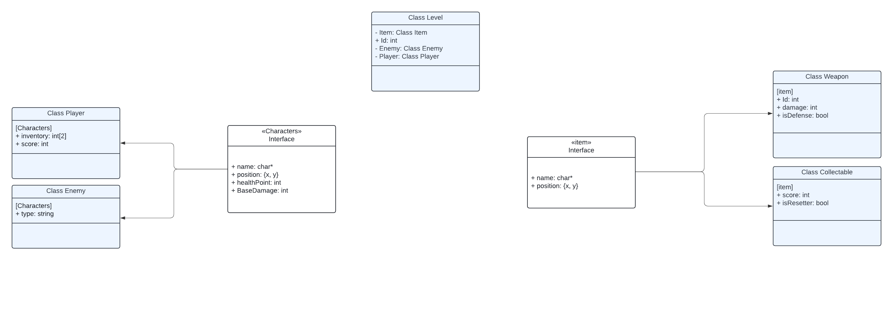

# Stickman Exploration - TechnicalSpecifications

Table of Contents

- [Stickman Exploration - TechnicalSpecifications](#stickman-exploration---technicalspecifications)
  - [Overview](#overview)
    - [Purpose](#purpose)
      - [Goals](#goals)
    - [Physics](#physics)
    - [Scope](#scope)
      - [In Scope](#in-scope)
      - [Out of Scope](#out-of-scope)
  - [Class diagram](#class-diagram)
    - [Hardware](#hardware)
    - [License](#license)

## Overview

### Purpose

#### Goals

This project aims to create a super mario bros like entirely made in C++ with the library SFML.

### Physics

- The player will have collision between him and walls, platforms, enemies
- Falling effect, if the player jump he will fall until he reach a floor

### Scope

#### In Scope

The goal for the player is to gather a lot of points and complete the level. After that he can compare his score with he friends to find the best one.

#### Out of Scope

The game will not have:

- A main menu
- A leaderboard
- Multiple Levels

## Class diagram

### Hardware

The interpreter will be compatible with the most common hardware configurations, and will be tested on the following hardware:

| Specification    | Lenovo ThinkBook 14 |
| ---------------- | ------------------- |
| Processor        | Intel Core i7-1255U |
| RAM[^15]         | 16 GB               |
| Operating System | Windows 11 Pro      |

### License

This project is licensed under the MIT License - see the [LICENSE](../LICENSE) file for details.
